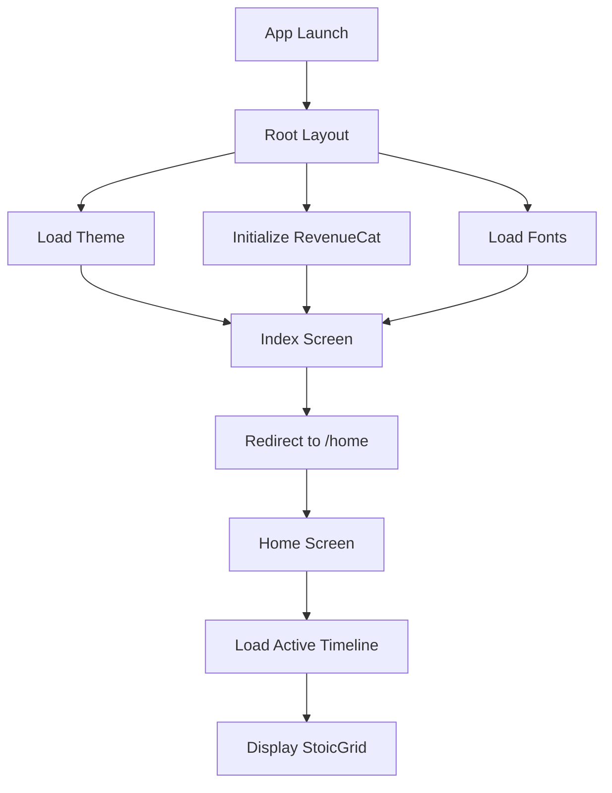
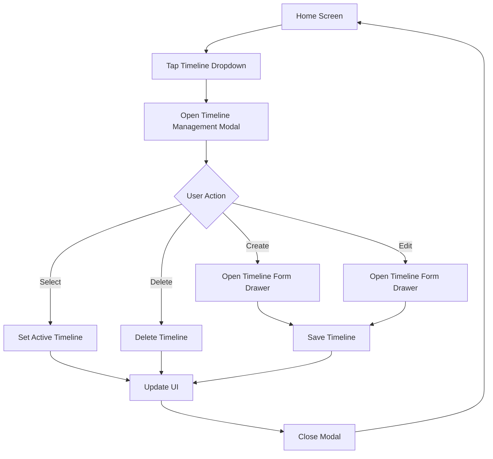

## Overview

Stoic Calendar uses Expo Router 6.0 for file-based routing with a Stack navigation structure. The app has a simple, flat routing hierarchy with modal presentations for settings and paywall screens.

## Routing Architecture

### File-Based System

Expo Router automatically generates routes from files in the `app/` directory:

```
app/
├── _layout.tsx           # Root layout with theme provider
├── index.tsx             # Entry point (redirects to /home)
├── home.tsx              # Main screen with active timeline
├── settings.tsx          # Settings modal
├── paywall.tsx           # Subscription paywall modal
└── customer-center.tsx   # Manage subscription modal
```

## Root Layout

**File**: `app/_layout.tsx`

The root layout provides:
- Theme provider (React Navigation)
- Status bar configuration
- RevenueCat initialization
- Widget data sync
- Deep linking setup
- Font loading (Cormorant Garamond)
- Theme preference management

**Key Features**:

```tsx
export default function RootLayout() {
  // Load user's theme preference from AsyncStorage
  const [userThemeMode, setUserThemeMode] = useState<ThemeMode>('dark');
  
  // Apply theme immediately
  useEffect(() => {
    const loadTheme = async () => {
      const themeMode = await getThemeMode();
      if (themeMode === 'system') {
        Appearance.setColorScheme(null);
      } else {
        Appearance.setColorScheme(themeMode);
      }
    };
    loadTheme();
  }, []);

  return (
    <ThemeProvider value={effectiveColorScheme === 'dark' ? DarkTheme : DefaultTheme}>
      <Stack>
        <Stack.Screen name="index" options={{ headerShown: false }} />
        <Stack.Screen name="home" options={{ headerShown: false }} />
        <Stack.Screen 
          name="settings" 
          options={{ 
            presentation: 'modal',
            headerShown: true,
            title: 'Settings'
          }} 
        />
        <Stack.Screen 
          name="paywall" 
          options={{ 
            presentation: 'modal',
            headerShown: false 
          }} 
        />
        <Stack.Screen 
          name="customer-center" 
          options={{ 
            presentation: 'modal',
            title: 'Manage Subscription',
            headerShown: true 
          }} 
        />
      </Stack>
      <StatusBar style="auto" />
    </ThemeProvider>
  );
}
```

## Screen Routes

### Index Screen

**Route**: `/`  
**File**: `app/index.tsx`

**Purpose**: Entry point that redirects to `/home`

```tsx
import { Redirect } from 'expo-router';

export default function Index() {
  return <Redirect href="/home" />;
}
```

### Home Screen

**Route**: `/home`  
**File**: `app/home.tsx`

**Purpose**: Main application screen displaying the active timeline

**Features**:
- Displays active timeline in StoicGrid
- Timeline dropdown selector
- Settings navigation button
- Timeline management button
- Week timeline auto-update on mount
- Date display overlay on dot press

**Key Implementation**:

```tsx
export default function HomeScreen() {
  const [activeTimeline, setActiveTimeline] = useState<Timeline | null>(null);
  const router = useRouter();

  // Load active timeline on mount
  useEffect(() => {
    const loadActiveTimeline = async () => {
      const timeline = await getActiveTimeline();
      setActiveTimeline(timeline);
    };
    loadActiveTimeline();
  }, []);

  return (
    <View style={styles.container}>
      <StoicGrid 
        timeline={activeTimeline} 
        animated={true}
        onDotPress={handleDotPress}
      />
    </View>
  );
}
```

### Settings Screen

**Route**: `/settings`  
**File**: `app/settings.tsx`  
**Presentation**: Modal

**Purpose**: App settings and configuration

**Sections**:
- Appearance (Theme, Grid Color)
- About (Version, Feedback)
- Philosophy (Stoic principles)
- Subscription (Pro features)

**Navigation Example**:

```tsx
import { useRouter } from 'expo-router';

const router = useRouter();
router.push('/settings');
```

### Paywall Screen

**Route**: `/paywall`  
**File**: `app/paywall.tsx`  
**Presentation**: Modal (fullscreen)

**Purpose**: Subscription purchase flow with RevenueCat

**Features**:
- Pro features showcase
- Subscription plans (monthly/yearly)
- Widget previews
- Free trial information
- Terms and privacy links

### Customer Center Screen

**Route**: `/customer-center`  
**File**: `app/customer-center.tsx`  
**Presentation**: Modal

**Purpose**: Manage active subscription

**Features**:
- View subscription status
- Cancel subscription
- Restore purchases
- RevenueCat Customer Center integration

## Navigation Patterns

### Programmatic Navigation

Use the `useRouter()` hook from Expo Router:

```tsx
import { useRouter } from 'expo-router';

function MyComponent() {
  const router = useRouter();

  // Navigate to screen
  const goToSettings = () => {
    router.push('/settings');
  };

  // Go back
  const goBack = () => {
    router.back();
  };

  // Replace current screen
  const replaceWithHome = () => {
    router.replace('/home');
  };
}
```

### Modal Presentation

Modals are configured in the root layout with `presentation: 'modal'`:

```tsx
<Stack.Screen 
  name="settings" 
  options={{ 
    presentation: 'modal',  // iOS-style modal presentation
    headerShown: true,      // Show navigation header
    title: 'Settings'       // Header title
  }} 
/>
```

### Deep Linking

The app supports deep linking for widget integration:

```tsx
useEffect(() => {
  const subscription = Linking.addEventListener('url', ({ url }) => {
    if (url === 'stoiccalendar://home') {
      router.push('/home');
    } else if (url === 'stoiccalendar://paywall') {
      router.push('/paywall');
    }
  });

  return () => subscription.remove();
}, [router]);
```

**Supported URLs**:
- `stoiccalendar://home` - Navigate to home screen
- `stoiccalendar://paywall` - Open paywall modal

## Navigation Flow

### App Launch Flow



### Timeline Management Flow



## Route Groups

Expo Router was previously structured with route groups `(tabs)` but has been simplified to a flat structure. The old tab-based navigation has been removed in favor of a single main screen with modal overlays.

**Previous Structure** (no longer used):
```
app/
└── (tabs)/
    ├── _layout.tsx
    ├── home.tsx
    ├── timelines.tsx
    └── settings.tsx
```

**Current Structure**:
```
app/
├── _layout.tsx
├── index.tsx
├── home.tsx
├── settings.tsx
└── paywall.tsx
```

## Type Safety

Expo Router provides type-safe navigation with TypeScript:

```tsx
import { Href, useRouter } from 'expo-router';

type AppRoutes = 
  | '/'
  | '/home'
  | '/settings'
  | '/paywall'
  | '/customer-center';

const router = useRouter();
router.push('/settings' as Href);
```

## Best Practices

### 1. Use Programmatic Navigation

Prefer `useRouter()` over `<Link>` components for better control:

```tsx
// Good
const router = useRouter();
router.push('/settings');

// Less flexible
import { Link } from 'expo-router';
<Link href="/settings">Settings</Link>
```

### 2. Handle Navigation State

Use `useFocusEffect` to refresh data when screen comes into focus:

```tsx
import { useFocusEffect } from '@react-navigation/native';

useFocusEffect(
  useCallback(() => {
    // Refresh data
    loadActiveTimeline();
  }, [])
);
```

### 3. Prevent Unnecessary Redirects

Check navigation state before redirecting:

```tsx
if (!activeTimeline) {
  router.replace('/home');
}
```

### 4. Clean Up Listeners

Always remove event listeners in cleanup:

```tsx
useEffect(() => {
  const subscription = Linking.addEventListener('url', handler);
  return () => subscription.remove();
}, []);
```

## Screen Options

Common screen options used throughout the app:

```tsx
// Full screen (no header)
<Stack.Screen 
  name="home" 
  options={{ headerShown: false }} 
/>

// Modal with header
<Stack.Screen 
  name="settings" 
  options={{ 
    presentation: 'modal',
    headerShown: true,
    title: 'Settings'
  }} 
/>

// Full screen modal
<Stack.Screen 
  name="paywall" 
  options={{ 
    presentation: 'modal',
    headerShown: false 
  }} 
/>
```